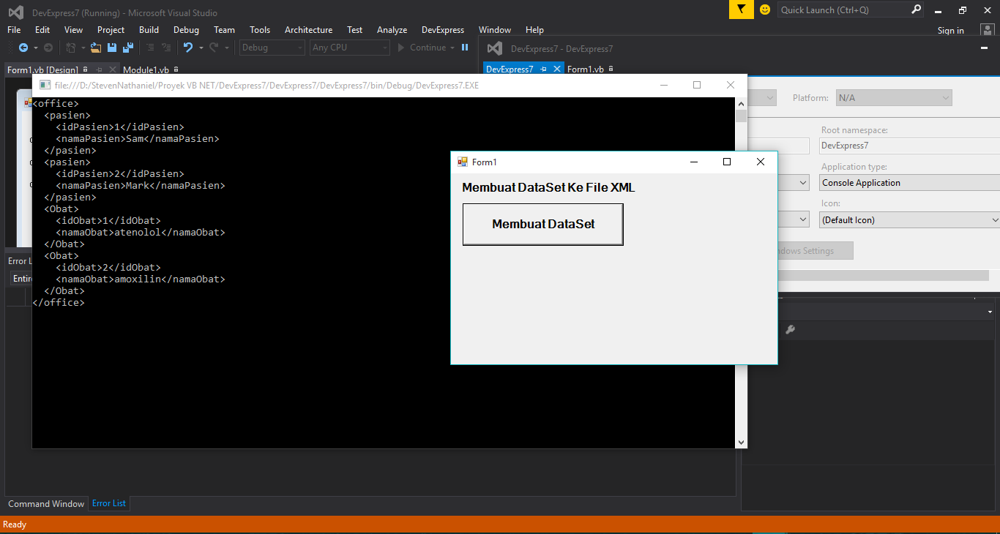
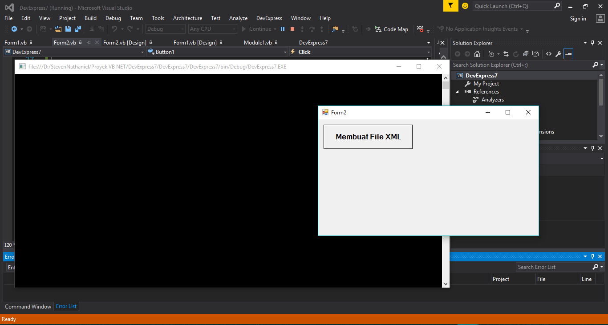
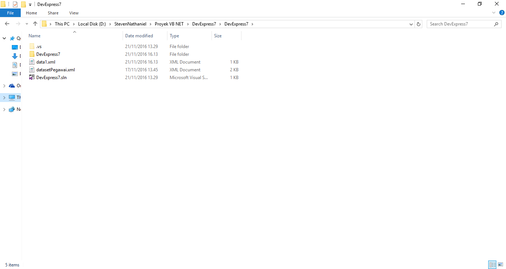

# Catatan Visual Basic .Net

_Catatan ini dibuat sebagai pengingat tentang pemrograman VB .Net_ . Di VB .Net mengerjakan project yg berkaitan dengan **aplikasi database untuk perkantoran** . Jadi kebanyakan data-datanya  berupa data text. Bisa untuk aplikasi di bidang administrasi atau keuangan (Akuntansi) . Sedang fokus ke pembuatan DataSet. Masih kesulitan memahami tentang table di dataset & bagaimana  melakukan query layaknya di table database **MySQL** . Ingin bisa menampilkan di console, data nama kolom dan data baris baris yg ada di bawah nama kolom itu. Untuk file yg di eksekusi sebagai sumber data sudah berupa **XML** . File XML ini di generate dari database MYSQL, yang di generate adalah data dari tabel nya.

Selanjutnya yg masih menjadi masalah adalah bagaimana bagamimana melakukan query terhadap data XML ini. Dibutuhkan kemampuan untuk mengenerate data dari tabel MySQL, melakukan query terhadap data yg ada di file XML dan kemudian menampilkannya di _console_ . Juga dibutuhkan kemampuan untuk melakukan **delete**, **update**, **insert** data ke file XML. Kemudian data di file XML ini dimasukan kembali ke database MySQL.


Akan mencoba tutorial di sini:

1. [DataSet](https://www.dotnetperls.com/dataset-vbnet)

   Setelah mengikuti tutorial di atas, pencapaian dalam percobaan coding yg berhasil hingga saat ini bisa di lihat di bawah ini:
   
   


   Untuk source code dari program di atas bisa dilihat disini:
   
   ```vb.net
   Imports System

   Imports System.Console

   Imports System.Data.SqlClient

   Imports System.Data

   Imports System.Data.Odbc

   Public Class Form1
      Private Sub Button1_Click(sender As Object, e As EventArgs) Handles Button1.Click

         ' Dua Tabel

         Dim table1 As DataTable = New DataTable("pasien")

         table1.Columns.Add("idPasien")

         table1.Columns.Add("namaPasien")

         table1.Rows.Add(1, "Sam")

         table1.Rows.Add(2, "Mark")


         Dim table2 As DataTable = New DataTable("Obat")

         table2.Columns.Add("idObat")

         table2.Columns.Add("namaObat")

         table2.Rows.Add(1, "atenolol")

         table2.Rows.Add(2, "amoxilin")


         ' Membuat sebuah Dataset, dan meletakan kedua tabel di dalam dataset itu.

         Dim set1 As DataSet = New DataSet("office")

         set1.Tables.Add(table1)

         set1.Tables.Add(table2)


         ' Visualize DataSet

         Console.WriteLine(set1.GetXml())

      End Sub
   End Class
   
   ```
   
   selanjutnya akan mencoba membuat agar apa yang sebelumnya ditampilkan di **Console/Terminal** bisa di simpan ke dalam bentuk file XML.
   
   Berikut ini tampilan visual dari program yang memiliki kemampuan untuk menyimpan ke dalam file XML, dataset yg saya buat diatas dan      telah saya tampilkan ke dalam Terminal:
   
   
   
   Di bawah ini screen shoot dari file XML yang berhasil kita buat. File XML telah tersimpan di dalam direktori, sesuai dengan alamat      direktori yang telah ditulis di codingan program ini.
   
   

_XML_ dan _JSON_ sangat penting dalam urusan _web service_, kedua type file ini wajib dikuasai penggunaannya bersama dengan _Visual Basic .Net_ dan _C#_ di _Visual Studio_. Untuk membangun web service yang sepertinya mudah dan bisa dikerjakan untuk saat ini adalah dengan menggunakan **WCF** dan **ASP .NET** . Untuk web server nya menggunakan _IIS (Internet Information Service)_ yang versi **Express** .


Nantinya web service ini berguna untuk komunikasi data antara aplikasi **desktop**, **mobile** dengan **server MySQL** . Sehingga untuk interface aplikasi tetap menggunakan aplikasi desktop dan mobile. teknologi web hanya berlaku di backend. web service ini akan memperluas jangkauan dari hanya LAN sehingga bisa mencapai seluruh dunia menggunakan internet.


