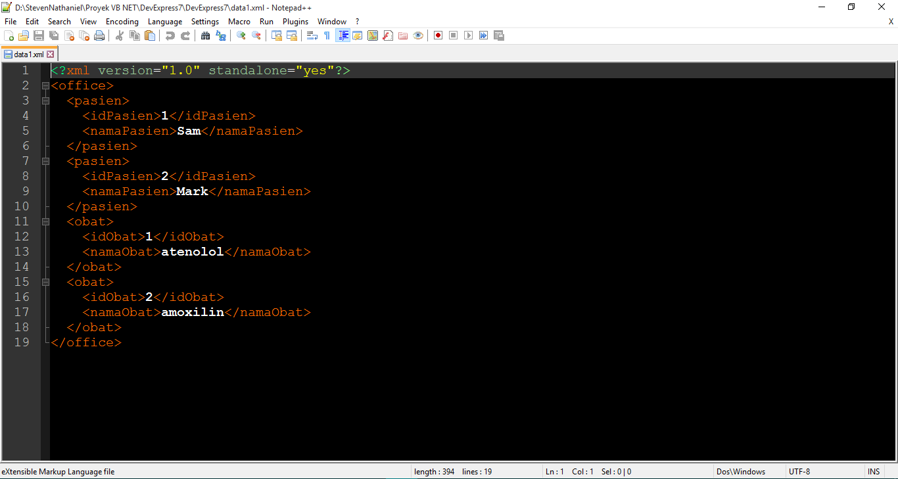

# Catatan Visual Basic .Net

_Catatan ini dibuat sebagai pengingat tentang pemrograman VB .Net_ . Di VB .Net mengerjakan project yg berkaitan dengan **aplikasi database untuk perkantoran** . Jadi kebanyakan data-datanya  berupa data text. Bisa untuk aplikasi di bidang administrasi atau keuangan (Akuntansi) . Sedang fokus ke pembuatan DataSet. Masih kesulitan memahami tentang table di dataset & bagaimana  melakukan query layaknya di table database **MySQL** . Ingin bisa menampilkan di console, data nama kolom dan data baris baris yg ada di bawah nama kolom itu. Untuk file yg di eksekusi sebagai sumber data sudah berupa **XML** . File XML ini di generate dari database MYSQL, yang di generate adalah data dari tabel nya.

Selanjutnya yg masih menjadi masalah adalah bagaimana bagamimana melakukan query terhadap data XML ini. Dibutuhkan kemampuan untuk mengenerate data dari tabel MySQL, melakukan query terhadap data yg ada di file XML dan kemudian menampilkannya di _console_ . Juga dibutuhkan kemampuan untuk melakukan **delete**, **update**, **insert** data ke file XML. Kemudian data di file XML ini dimasukan kembali ke database MySQL.


Akan mencoba tutorial di sini:

1. [DataSet](https://www.dotnetperls.com/dataset-vbnet)

   Setelah mengikuti tutorial di atas, pencapaian dalam percobaan coding yg berhasil hingga saat ini bisa di lihat di bawah ini:
   
   


   Untuk source code dari program di atas bisa dilihat disini:
   
   ```vb.net
   Imports System

   Imports System.Console

   Imports System.Data.SqlClient

   Imports System.Data

   Imports System.Data.Odbc

   Public Class Form1
      Private Sub Button1_Click(sender As Object, e As EventArgs) Handles Button1.Click

         ' Dua Tabel

         Dim table1 As DataTable = New DataTable("pasien")

         table1.Columns.Add("idPasien")

         table1.Columns.Add("namaPasien")

         table1.Rows.Add(1, "Sam")

         table1.Rows.Add(2, "Mark")


         Dim table2 As DataTable = New DataTable("Obat")

         table2.Columns.Add("idObat")

         table2.Columns.Add("namaObat")

         table2.Rows.Add(1, "atenolol")

         table2.Rows.Add(2, "amoxilin")


         ' Membuat sebuah Dataset, dan meletakan kedua tabel di dalam dataset itu.

         Dim set1 As DataSet = New DataSet("office")

         set1.Tables.Add(table1)

         set1.Tables.Add(table2)


         ' Visualize DataSet

         Console.WriteLine(set1.GetXml())

      End Sub
   End Class
   
   ```
   
   selanjutnya akan mencoba membuat agar apa yang sebelumnya ditampilkan di **Console/Terminal** bisa di simpan ke dalam bentuk file XML.
   
   Berikut ini tampilan visual dari program yang memiliki kemampuan untuk menyimpan ke dalam file XML, dataset yg saya buat diatas dan      telah saya tampilkan ke dalam Terminal:
   
   
   
   Di bawah ini screen shoot dari file XML yang berhasil kita buat. File XML telah tersimpan di dalam direktori, sesuai dengan alamat      direktori yang telah ditulis di codingan program ini.
   
   
   
   Di bawah ini screen shoot dari tampilan isi file XML yang berhasil dibuat:
   
   
   
   Untuk source code dari program yg bisa menyimpan Dataset yang telah dibuat ke dalam file XML, bisa dilihat di bawah ini:
   
   ```vb.net
   Imports System

   Imports System.Console

   Imports System.Data.SqlClient

   Imports System.Data

   Imports System.Data.Odbc


   Public Class Form2
      Private Sub Button1_Click(sender As Object, e As EventArgs) Handles Button1.Click

         ' Dua Tabel

         Dim tabel1 As DataTable = New DataTable("pasien")

         tabel1.Columns.Add("idPasien")

         tabel1.Columns.Add("namaPasien")

         tabel1.Rows.Add(1, "Sam")

         tabel1.Rows.Add(2, "Mark")


         Dim tabel2 As DataTable = New DataTable("obat")

         tabel2.Columns.Add("idObat")

         tabel2.Columns.Add("namaObat")

         tabel2.Rows.Add(1, "atenolol")

         tabel2.Rows.Add(2, "amoxilin")


         Dim set1 As DataSet = New DataSet("office")

         set1.Tables.Add(tabel1)

         set1.Tables.Add(tabel2)


         set1.WriteXml("D:\StevenNathaniel\Proyek VB NET\DevExpress7\DevExpress7\data1.xml")


      End Sub
   End Class
   
   ```
   File yang berhasil dibuat dari program diatas, bisa dilihat [**disini**](https://github.com/rootonunix/gambar/blob/master/data1.xml)
## Query File XML

Selanjutnya akan mencoba melakukan query terhadap file XML , untuk menampilkan column dan data tertentu. Mencoba mencari info dengan kata kunci:

**vb .net + query file xml**

Menemukan halaman ini:

[.NET Language-Integrated Query for XML Data](https://msdn.microsoft.com/en-us/library/bb308960.aspx)

jadi harus belajar tentang **LINQ**, mencoba memahirkan penggunaan LINQ di file **XML**. sambil juga  mencoba untuk menerapkan XML yg sudah ada di **DevExpress Report** . 

_Ada tutorial tentang membuat file XML dari scratch:_

[Creating XML from Scratch](https://msdn.microsoft.com/en-us/library/bb308960.aspx#xlinqoverview_topic2e)


_Tutorial tentang membuat file XML menggunakan LINQ tapi masih tanpa ada source code VB .NET nya. masih cari yg ada VB .NET nya:_

[LINQ to XML : Creating complete XML document](https://blogs.msdn.microsoft.com/wriju/2008/02/28/linq-to-xml-creating-complete-xml-document/)

sudah berhasil melakukan **query** terhadap file XML menggunakan **LINQ** dengan mengikuti tutorial di sini:

[LINQ to XML in VB.NET](http://stackoverflow.com/questions/1066213/linq-to-xml-in-vb-net/1066418#1066418)

**Source code yang di uji cobakan di Visual Studio 2015:**

```vb.net
Imports System

Imports System.Console

Imports System.Data.SqlClient

Imports System.Data

Imports System.Data.Odbc


Module fileXML

    Dim data1Xml = <Xml>
                       <office>
                           <pasien>
                               <idPasien>1</idPasien>
                               <namaPasien>Sam</namaPasien>
                           </pasien>
                           <pasien>
                               <idPasien>2</idPasien>
                               <namaPasien>Mark</namaPasien>
                           </pasien>
                           <obat>
                               <idObat>1</idObat>
                               <namaObat>atenolol</namaObat>
                           </obat>
                           <obat>
                               <idObat>2</idObat>
                               <namaObat>amoxilin</namaObat>
                           </obat>
                       </office>
                   </Xml>

    Sub xmlKueri()

        Dim data1Doc = System.Xml.Linq.XDocument.Parse(data1Xml.ToString())

        Dim obats = From obat In data1Doc...<obat> Select obat


        For Each obat In obats

            Console.WriteLine("ID obat {0}", obat.<idObat>.Value)

            Console.WriteLine("Nama obat {0}", obat.<namaObat>.Value)
        Next

    End Sub


End Module

Public Class Form3

    Private Sub Button1_Click(sender As Object, e As EventArgs) Handles Button1.Click


        Call xmlKueri()


    End Sub
End Class
```


_XML_ dan _JSON_ sangat penting dalam urusan _web service_, kedua type file ini wajib dikuasai penggunaannya bersama dengan _Visual Basic .Net_ dan _C#_ di _Visual Studio_. Untuk membangun web service yang sepertinya mudah dan bisa dikerjakan untuk saat ini adalah dengan menggunakan **WCF** dan **ASP .NET** . Untuk web server nya menggunakan _IIS (Internet Information Service)_ yang versi **Express** .


Nantinya web service ini berguna untuk komunikasi data antara aplikasi **desktop**, **mobile** dengan **server MySQL** . Sehingga untuk interface aplikasi tetap menggunakan aplikasi desktop dan mobile. teknologi web hanya berlaku di backend. web service ini akan memperluas jangkauan dari hanya LAN sehingga bisa mencapai seluruh dunia menggunakan internet.


